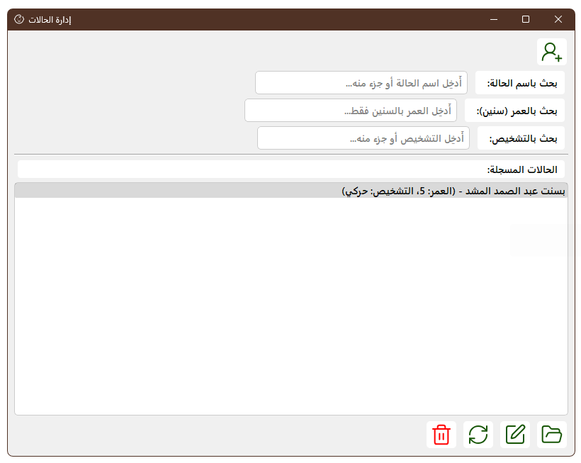
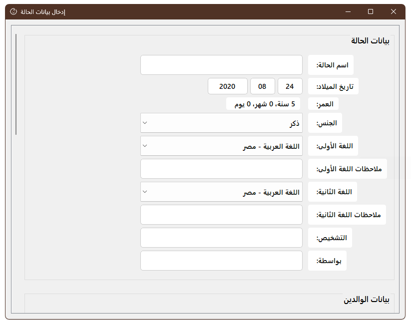
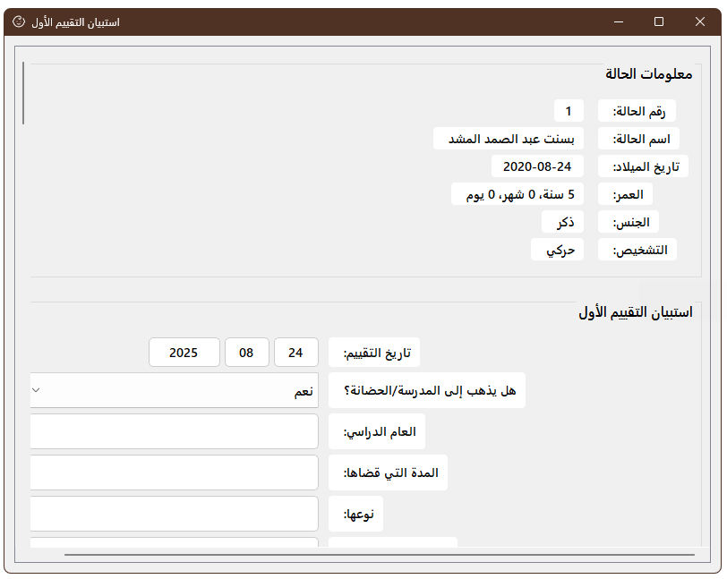
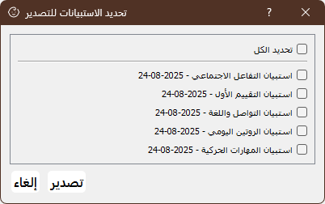
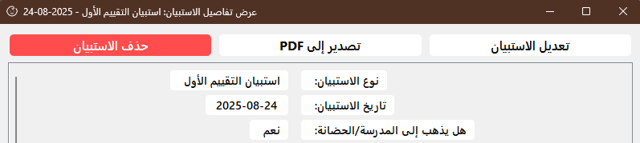

# MYCASES_APP

  
  
  

MYCASES_APP is a **desktop application built with PyQt5** designed for **special needs schools**.  
It helps psychological and behavioral supervisors to **create, manage, and review individual child case files**, including personal information, behavioral assessments, and survey reports.  
The app also supports **PDF exporting** for official reporting.  
The app is prepared so that in future development, it can support **dual-language interfaces (Arabic & English)**.

---

## ✨ Features

- 📂 **Case Management**  
  - Create, edit, and save detailed case files in JSON format.  
  - Store personal information, family details, and behavioral notes.  

- 📝 **Survey Management**  
  - Add and manage psychological/behavioral surveys.  
  - Auto-calculate ages (child, parents, pregnancy).  

- 🌍 **Multi-language Support**  
  - Dual UI support: **Arabic (RTL)** and **English (LTR)**.  
  - Translation system via `assets/translations/`.  

- 📑 **PDF Exporting**  
  - Export complete case files as PDF.  
  - Export post-survey reports with professional formatting.  

- 🖥 **User-Friendly Interface**  
  - Dropdowns, forms, and aligned input fields for efficient data entry.  
  - Prevents accidental changes (e.g., mouse scroll on dropdowns).  

- ⚙️ **Configuration & Packaging**  
  - JSON-based configuration (`config.json`).  
  - Packaged with **PyInstaller** for Windows executables.  

---

## 📸 Screenshots

> Replace the placeholder images with actual screenshots of your app.

- **Main Dashboard**  
  

- **Case Form**  
  

- **Survey Manager**  
  

- **PDF Export Example**  
  
  
---

## 🚀 Installation

### 1. Clone the repository
```bash
git clone https://github.com/mofasuhu/mycases_app.git
cd mycases_app
```

### 2. Create a virtual environment (recommended)
```bash
python -m venv venv
source venv/bin/activate   # On Linux/Mac
venv\Scripts\activate      # On Windows
```

### 3. Install dependencies
```bash
pip install -r requirements.txt
```

### 4. Run the application
```bash
python main.py
```

---

## ⚙️ Configuration

- **`config.json`**  
  Stores global settings (paths, defaults, etc.).  

- **`assets/translations/`**  
  Contains translation files for Arabic/English UI.  

- **`styles/`, `fonts/`, `icons/`**  
  Define the look and feel of the app.  

---

## 📂 Project Structure

```
mycases_app/
│
├── assets/               # Translations and resources
│   └── translations/
│
├── fonts/                # Fonts used in UI
├── icons/                # App icons
├── styles/               # Styling resources
│
├── ui/                   # UI components (forms, viewers)
│   ├── case_form.py
│   ├── survey_manager.py
│   ├── pdf_viewer.py
│   └── ...
│
├── utils/                # Utility scripts
│   ├── pdf_export.py
│   ├── age_calculator.py
│   ├── translator.py
│   └── ...
│
├── main.py               # Application entry point
├── requirements.txt      # Python dependencies
├── config.json           # App configuration
├── *.spec                # PyInstaller build configs
└── *.bat                 # Windows helper scripts
```

---

## 🔨 Development & Contribution

1. Fork the repository.  
2. Create a new branch:  
   ```bash
   git checkout -b feature/new-feature
   ```
3. Commit changes:  
   ```bash
   git commit -m "Add new feature"
   ```
4. Push the branch and open a PR.  

---

## 📦 Building Executable (Windows)

To package the app into an `.exe`:

```bash
pyinstaller --noconfirm mycases_app.spec
```

The executable will be available inside the `dist/` folder.

---

## 📜 License

This project is licensed under the **MIT License**.  
See the [LICENSE](LICENSE) file for details.

---

## 👤 Author

**Farouk (mofasuhu)**  
🔗 [Portfolio](https://mofasuhu.github.io)  
